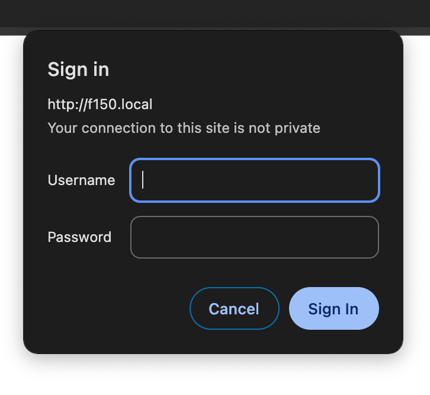

# F150 Remote Start

## Problem

The range of the remote start on a 2014 F150 is abysmal. I often have to walk outside my house just to get the remote start to work. 


## Solution

Using a spare keyfob and a wemos D1 Mini microcontroller, create a semi-permenant remote start beacon that can be stationed near my truck, that can start my truck from my phone/home-assistant. 

The box is placed anywhere that is within range of wifi and the vehicle. 


**Warning** : Never start a vehicle inside an enclosed space (such as a garage), the CO2 buildup is deadly. Only remotely start a vehile that is outdoors. 


## Hardware

- [Additional Key Fobs](https://www.amazon.com/gp/product/B06XS3351F/ref=ewc_pr_img_2?smid=A5K9LFXZIQJ2T&th=1)
- [PCBs (optional)](https://www.amazon.com/ELEGOO-Prototype-Soldering-Compatible-Arduino/dp/B072Z7Y19F/ref=sr_1_1?crid=2MVKI8RNQ46D1&keywords=pcb&qid=1706154816&sprefix=pc%2Caps%2C190&sr=8-1)
- [Wimos D1 mini ESP8266](https://www.amazon.com/Aceirmc-ESP8266-Internet-Development-Compatible/dp/B07V84VWSM/ref=sr_1_3?crid=2LTTXJFAVP1XG&keywords=wemos+d1+mini&qid=1706154840&sprefix=wemos+d1+mini%2Caps%2C132&sr=8-3)
- [Any 5V WS2812x Led strip or led](https://www.amazon.com/ALITOVE-100pcs-WS2812B-Addressable-Arduino/dp/B01D1FFVOA/ref=sr_1_9?crid=PUPYNE639ZOX&keywords=addressable+led&qid=1706237299&sprefix=addressable+le%2Caps%2C212&sr=8-9)

Video on programming [f150 keyfobs](https://www.youtube.com/watch?v=c2BaSCcAnhg).


## Schematic

My particular keyfob has buttons that pull signal low (gnd) when pressed.

|GPIO| Pin|
| --- | --- |
| D5 | Lock |
| D6 | Unlock |
| D7 | Start |
| 2 | Status LED | 
| D3 | RGB Led | 


My particular truck has the following sequence to do a remote start
1. Press lock button 
2. Press remote start button twice
3. (Truck will start)
4. Press unlock button to enter truck


## 3d Printing

STL and 3MF files are included in the [3d prints](./3d%20prints/) folder. 

A pre-sliced multi color print for bambu x1c is provided. 

Printed with PETG

| Color | AMS slot | 
|--- | --- | 
| black | 1 |
| clear | 3 |
| blue | 4 | 


## Leds

The lid is printed with transparent PETG fillament to show the internal Led status. 

```
Lock = Red
Unlock = Green
Start = Rainbow Animation
Stop = Blue
```

The LEDs will light up for 10 minutes (the max amount of time an F150 remote start will idle for), then return to white. 


## Development

Assuming you are using `direnv`, setup an `.envrc` file with environment variables to load. 

```
ls /dev/cu*   #note the address of the usb device
echo 'export USB_ADDRESS=/dev/cu.usbserial-xxxx' > .envrc
```

Make a `secrets.yaml` file

```bash
touch conf.d/secrets.yaml
```

Then add the following variables:
```yaml
wifi_ssid: "foobar"
wifi_password: "correct-horse-battery-staple"
web_username: "admin"
web_password: "correct-horse-battery-staple"
```

Then compile and upload the firmware

`make run-ota`

Then navigate to [http://f150.local](http://f150.local) on the network


  
